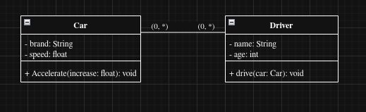
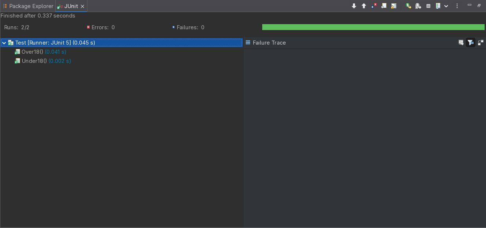
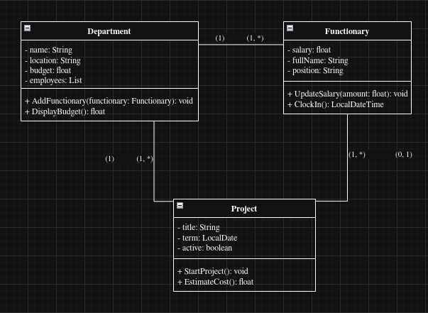
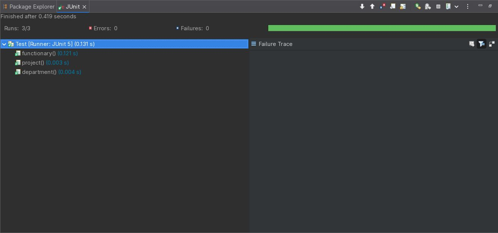

# bertoti-enegenhariadesoftware

 

## 📚 Comments on excerpts from the book "Sofware Engineering at Google"

 

The opening section is an introduction to a book on best practices, which discusses the differences between terms used in the field of technology, furthermore, it compares software engineering with more traditional engineering, highlighting the need for greater rigor in systems development.

 

The second section introduces reflections on the development of softwares based on sustainability, and cites three principles for "Programming Over Time": "Time and Change", "Scale and Growth" and "Trade-offs and Costs".

 

## 🤝 Examples and explanations of trade-offs

 

- Storage against speed - storing compressed data to save memory against using caching to avoid recalculations.

- Functionality against simplicity - increasing complexity for advanced tools against making it more intuitive for more people.

- Security against usability - having high protection for important data against having convenience for easier access.

 

## 💻 Diagram and JUnit test

 

- Drive
  

[code here](code/drive/)

 

- Human resources

[code here](code/human-resources/)
